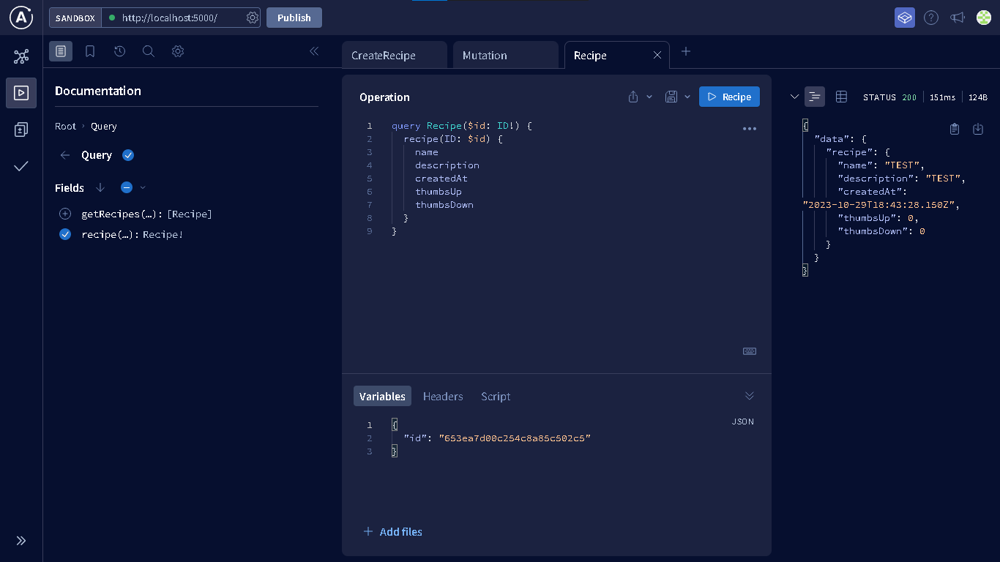

# Graphql MongoDB
This project is an Apollo server GraphQL API which connects to a MongoDB Atlas database and provides CRUD functionality to manage recipe data.

# Get started
Clone this repository, install dependencies, and start server:
```
git clone
cd graphql-mongodb
npm i
npm start
```
A simple way to test the api is by heading over to (localhost:5000), which runs an Apollo GraphQl sandbox.

# screenshots
